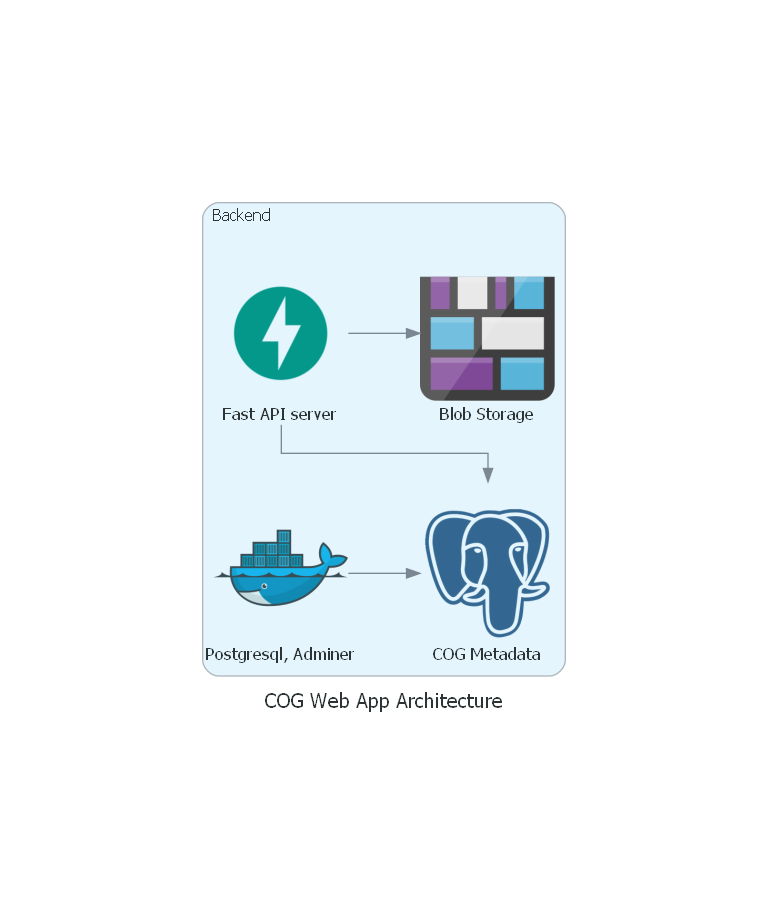

## Flow Diagram for COG image storage

###### Prequisites
* Public S3 Bucket setup
* Docker Engine
* Python v - 3.9.11

## Deploying the FastAPI service

- Following steps should let you run the server from local machine

1. `git checkout dev`

2. Go to root i.e. `cd /server`

3. From root, initiate the Docker Compose file to spin up PostgreSQL DB and Adminer service. TO do this run
    ` docker-compose up -d`  *This runs the containers in detached mode*

4. Once the docker-compose is up and running you can check the service at `localhost://8080` and enter the following details in Adminer

   **POSTGRES_USER: docker**
   **POSTGRES_PASSWORD: hatfield**
   **POSTGRES_DB: cogdb**

   > These details can also be found in the `docker-compose.yaml` file.
## To run the app locally, uncommet __main__() in `main.py` file and follow the following steps
1. Once the docker container is up and running, go to `/cogapp-venv/scripts/` run the command `activate` to activate the necessary libraries and dependencies

2. Now, to run the backend and test the API, run the following command from root (`cd ../../`)
    `python3 main.py`

3. The service can be tested from FastAPI's default provided Swagger UI at `localhost:8000/docs`

    * The API shows two end points get() and post().
    * The end points can be tested from the server side by executing each with the "Try it out" functionality

## To run the app through docker deployement commands follow the below steps
1. From root (`server`) run

`docker build -t server-cogapp .`

2. Once the image of the app with the tag `server-cogapp` is created run

`docker run -d -p 80:8000`

3. Once the container of `server-cogapp` is created and ready to run,

`docker-compose up --build`

> All dependencies can be installed from `./requirements.txt`

> The app can be accessed at `http://localhost:8000/docs` or another port depending the value of port mapped

# Initiate the database

create table "cogdb_table";
ALTER TABLE "cogdb_table"
ADD "id" serial NOT NULL,
ADD PRIMARY KEY ("id"),
ADD "image_title" character varying(500) NOT NULL,
ADD "image_url" character varying(500) NOT NULL,
ADD "image_crs" character varying(500) NOT NULL,
ADD "image_bounds" character varying(500) NOT NULL;
COMMENT ON TABLE "cogdb_table" IS '';

# Test COGs

321MB https://opendata.digitalglobe.com/events/mauritius-oil-spill/post-event/2020-08-12/105001001F1B5B00/105001001F1B5B00.tif
221KB https://sentinel-cogs.s3.us-west-2.amazonaws.com/sentinel-s2-l2a-cogs/34/S/GA/2020/3/S2A_34SGA_20200301_0_L2A/L2A_PVI.tif
  https://rasterupload.blob.core.windows.net/cog-raster-files/L2A_PVI.tif
5.1MB https://sentinel-cogs.s3.us-west-2.amazonaws.com/sentinel-s2-l2a-cogs/34/S/GA/2020/3/S2A_34SGA_20200301_0_L2A/B01.tif
170MB https://sentinel-cogs.s3.us-west-2.amazonaws.com/sentinel-s2-l2a-cogs/34/S/GA/2020/3/S2A_34SGA_20200301_0_L2A/B02.tif
